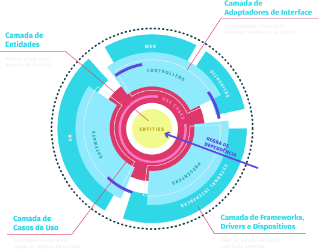

# **Clean Architecture Node API with Typescript**

  

This API is part of the training of Professor Rodrigo Manguinho (Mango) at Udemy.
The objective of the training is to show how to create an API with a well-defined and decoupled architecture, using TDD (test-oriented programming) as a working methodology, Clean Architecture to distribute responsibilities in layers, always following the principles of SOLID and, whenever possible, applying Design Patterns to solve some common problems.
  

## [**Link to API documentation**](http://fordevs.herokuapp.com/api-docs)

> ## APIs built in training

1. [SignUp](./requirements/signup.md)
2. [Login](./requirements/login.md)
3. [Add survey](./requirements/add-survey.md)
4. [Load survey](./requirements/load-surveys.md)
5. [Save survey result](./requirements/save-survey-result.md)
6. [Load survey result](./requirements/load-survey-result.md)

> ## Principles

* Single Responsibility Principle (SRP)
* Open Closed Principle (OCP)
* Liskov Substitution Principle (LSP)
* Interface Segregation Principle (ISP)
* Dependency Inversion Principle (DIP)
* Separation of Concerns (SOC)
* Don't Repeat Yourself (DRY)
* You Aren't Gonna Need It (YAGNI)
* Keep It Simple, Silly (KISS)
* Composition Over Inheritance
* Small Commits

> ## Design Patterns

* Factory
* Adapter
* Composite
* Decorator
* Proxy
* Dependency Injection
* Abstract Server
* Composition Root
* Builder
* Singleton

> ## Methodologies and Designs

* TDD
* Clean Architecture
* DDD
* Conventional Commits
* GitFlow
* Modular Design
* Dependency Diagrams
* Use Cases
* Continuous Integration
* Continuous Delivery
* Continuous Deployment

> ## Libraries and Tools

* NPM
* Typescript
* Git
* Docker
* Jest
* MongoDb
* Travis CI
* Swagger
* Bcrypt
* JsonWebToken
* Faker
* Coveralls
* Validator
* Express
* Apollo Server Express
* Graphql
* Graphql ISO Date
* Graphql Scalars
* Graphql Tools
* Supertest
* Husky
* Lint Staged
* Eslint
* Standard Javascript Style
* Sucrase
* Nodemon
* Rimraf
* In-Memory MongoDb Server
* MockDate
* Module-Alias
* Copyfiles
* Npm Check
* Bson ObjectId
* Apollo Server Integration Testing

> ## Node Features

* Documentação de API com Swagger
* API Rest com Express
* GraphQL com Apollo Server
* Log de Erro
* Segurança (Hashing, Encryption e Encoding)
* CORS
* Middlewares
* Nível de Acesso nas Rotas (Admin, User e Anônimo)
* Deploy no Heroku
* Servir Arquivos Estáticos

> ## Git Features

* Alias
* Log Personalizado
* Branch
* Reset
* Amend
* Tag
* Stash
* Rebase
* Merge

> ## Features do Typescript

* OO Advanced
* Interface
* TypeAlias
* Namespace
* Utility Types
* Modules Paths
* settings
* Build
* Deploy
* Breakpoints

> ## Features do GraphQL

* Resolvers
* Type Definitions
* Directives
* Scalars
* Plugins
* Error Handling

> ## Tests Features

* Unit tests
* Integration Tests (API Rest & GraphQL)
* Test Coverage
* Test Doubles
* Mocks
* Stubs
* Spies
* Fakes

> ## MongoDb Features

* Connect e Reconnect
* Collections
* InsertOne e InserMany
* Find, FindOne e FindOneAndUpdate
* DeleteMany
* UpdateOne
* Aggregation (Match, Group, Unwind, Lookup, AddFields, Project, Sort)
* ObjectId
* Upsert e ReturnOriginal
* Push, Divide, Multiply, ArrayElemAt, Cond, Sum
* Filter, Map, Reduce, MergeObjects, ConcatArrays